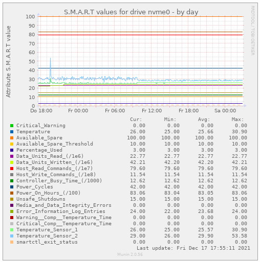

# munin-smart-nvme
`smartctlcvt` converts smartctl output for NVMe drives to old format (readable for munin smart_ plugin)


Munin has a very nice SMART plugin. Alas, it doesn’t work with NVMe, because smartctl has a new output format for these drives, so the plugin is unable to parse it.

My workaround (instead of rewriting the plugin, which is beyond my skills) is to convert the smartctl output into the old format and pass this to the plugin.

Installation is simple:
Copy smartctlcvt to a directory of your choice and add the path to `/etc/munin/plugin-conf.d/munin-node`

e.g:

```
[smart_nvme*]
user root
env.smartpath /path/to/smartctlcvt
```

NVMe-drives are then recognized by the smart_ plugin:



(All values are scaled into the range 0-100)	
